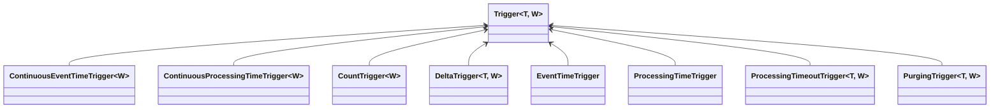

# 1. Window概念
> 窗口（Window）是处理无界流的关键所在。窗口可以将数据流装入大小有限的“桶”中，再对每个“桶”加以处理。

通常来讲，window就是对一个无限的流数据加上边界，使其成为多个有界的集合，在对每个集合进行处理，和Spark Streaming类似

# 2. Window结构
在给一个流添加window时，WIndowAssigner是必须指定的，而evictor和trigger则是可选的。数据流向图如下

**Keyed Windows**

```java
stream
       .keyBy(...)               <-  keyed versus non-keyed windows
       .window(...)              <-  required: "assigner"
      [.trigger(...)]            <-  optional: "trigger" (else default trigger)
      [.evictor(...)]            <-  optional: "evictor" (else no evictor)
      [.allowedLateness(...)]    <-  optional: "lateness" (else zero)
      [.sideOutputLateData(...)] <-  optional: "output tag" (else no side output for late data)
       .reduce/aggregate/apply()      <-  required: "function"
      [.getSideOutput(...)]      <-  optional: "output tag"
```
**Non-Keyed Windows**
```java
stream
       .windowAll(...)           <-  required: "assigner"
      [.trigger(...)]            <-  optional: "trigger" (else default trigger)
      [.evictor(...)]            <-  optional: "evictor" (else no evictor)
      [.allowedLateness(...)]    <-  optional: "lateness" (else zero)
      [.sideOutputLateData(...)] <-  optional: "output tag" (else no side output for late data)
       .reduce/aggregate/apply()      <-  required: "function"
      [.getSideOutput(...)]      <-  optional: "output tag"
```
p.s. keyby和sql里面的groupby类似，即是否将数据分组后处理。如果进行分组，不通过key既可以将任务分发到集群上进行并发处理

# 3. Window Assigners 
在flink中内置了许多window assigner，可以分为以下两类

- 基于时间的assigner
   - tumbling windows
   - sliding windows
   - session windows
- 不基于时间的assigner
   - global windows

基于时间的窗口比较好理解，一般是随着时间的推进进行窗口划分（ tumbling windows、sliding windows），或是基于时间间隔进行划分（session windows）
比较特殊的是不基于时间的assigner（global windows）。使用global windows时，需要自己定义Trigger来触发计算，以及缓存数据的清理。
## 3.1 滚动窗口（Tumbling Windows）
滚动窗口的 assigner 分发元素到指定大小的窗口。滚动窗口的大小是固定的，且各自范围之间不重叠。 比如说，如果你指定了滚动窗口的大小为 5 分钟，那么每 5 分钟就会有一个窗口被计算，且一个新的窗口被创建（如下图所示）


```java
DataStream<T> input = ...;
// 时间间隔可以用 Time.milliseconds(x)、Time.seconds(x)、Time.minutes(x) 等来指定。
// 滚动 event-time 窗口
input
    .keyBy(<key selector>)
    .window(TumblingEventTimeWindows.of(Time.seconds(5)))
    .<windowed transformation>(<window function>);

// 滚动 processing-time 窗口
input
    .keyBy(<key selector>)
    .window(TumblingProcessingTimeWindows.of(Time.seconds(5)))
    .<windowed transformation>(<window function>);

// 长度为一天的滚动 event-time 窗口， 偏移量为 -8 小时。
input
    .keyBy(<key selector>)
    .window(TumblingEventTimeWindows.of(Time.days(1), Time.hours(-8)))
    .<windowed transformation>(<window function>);
```

## 3.2 滑动窗口（Sliding Windows）
与滚动窗口类似，滑动窗口的 assigner 分发元素到指定大小的窗口，窗口大小通过 _window size_ 参数设置。 滑动窗口需要一个额外的滑动距离（_window slide_）参数来控制生成新窗口的频率。 因此，如果 slide 小于窗口大小，滑动窗口可以允许窗口重叠。这种情况下，一个元素可能会被分发到多个窗口。
比如说，你设置了大小为 10 分钟，滑动距离 5 分钟的窗口，你会在每 5 分钟得到一个新的窗口， 里面包含之前 10 分钟到达的数据（如下图所示）。


```java
DataStream<T> input = ...;

// 滑动 event-time 窗口
input
    .keyBy(<key selector>)
    .window(SlidingEventTimeWindows.of(Time.seconds(10), Time.seconds(5)))
    .<windowed transformation>(<window function>);

// 滑动 processing-time 窗口
input
    .keyBy(<key selector>)
    .window(SlidingProcessingTimeWindows.of(Time.seconds(10), Time.seconds(5)))
    .<windowed transformation>(<window function>);

// 滑动 processing-time 窗口，偏移量为 -8 小时
input
    .keyBy(<key selector>)
    .window(SlidingProcessingTimeWindows.of(Time.hours(12), Time.hours(1), Time.hours(-8)))
    .<windowed transformation>(<window function>);
```
## 3.3 会话窗口（Session Windows）
会话窗口的 assigner 会把数据按活跃的会话分组。 与滚动窗口和滑动窗口不同，会话窗口不会相互重叠，且没有固定的开始或结束时间。 会话窗口在一段时间没有收到数据之后会关闭，即在一段不活跃的间隔之后。 会话窗口的 assigner 可以设置固定的会话间隔（session gap）或 用 session gap extractor 函数来动态地定义多长时间算作不活跃。 当超出了不活跃的时间段，当前的会话就会关闭，并且将接下来的数据分发到新的会话窗口。


```java
DataStream<T> input = ...;

// 设置了固定间隔的 event-time 会话窗口
input
    .keyBy(<key selector>)
    .window(EventTimeSessionWindows.withGap(Time.minutes(10)))
    .<windowed transformation>(<window function>);
    
// 设置了动态间隔的 event-time 会话窗口
input
    .keyBy(<key selector>)
    .window(EventTimeSessionWindows.withDynamicGap((element) -> {
        // 决定并返回会话间隔
    }))
    .<windowed transformation>(<window function>);

// 设置了固定间隔的 processing-time session 窗口
input
    .keyBy(<key selector>)
    .window(ProcessingTimeSessionWindows.withGap(Time.minutes(10)))
    .<windowed transformation>(<window function>);
    
// 设置了动态间隔的 processing-time 会话窗口
input
    .keyBy(<key selector>)
    .window(ProcessingTimeSessionWindows.withDynamicGap((element) -> {
        // 决定并返回会话间隔
    }))
    .<windowed transformation>(<window function>);
```
## 3.4 全局窗口
全局窗口的 assigner 将拥有相同 key 的所有数据分发到一个全局窗口。 **这样的窗口模式仅在你指定了自定义的 trigger 时有用。 否则，计算不会发生，因为全局窗口没有天然的终点去触发其中积累的数据**。

```java
DataStream<T> input = ...;

input
    .keyBy(<key selector>)
    .window(GlobalWindows.create())
    .<windowed transformation>(<window function>);
```

# 4. Trigger
Trigger 决定了一个窗口（由 window assigner 定义）何时可以被 window function 处理。 每个 WindowAssigner 都有一个默认的 Trigger。 如果默认 trigger 无法满足你的需要，你可以在 trigger(...) 调用中指定自定义的 trigger。
Trigger 接口提供了五个方法来响应不同的事件：

- onElement() 方法在每个元素被加入窗口时调用。
- onEventTime() 方法在注册的 event-time timer 触发时调用。
- onProcessingTime() 方法在注册的 processing-time timer 触发时调用。
- onMerge() 方法与有状态的 trigger 相关。该方法会在两个窗口合并时， 将窗口对应 trigger 的状态进行合并，比如使用会话窗口时。
- 最后，clear() 方法处理在对应窗口被移除时所需的逻辑。

有两点需要注意：

1. 前三个方法通过返回 TriggerResult 来决定 trigger 如何应对到达窗口的事件。应对方案有以下几种：
- CONTINUE: 什么也不做
- FIRE: 触发计算
- PURGE: 清空窗口内的元素
- FIRE_AND_PURGE: 触发计算，计算结束后清空窗口内的元素
2. 上面的任意方法都可以用来注册 processing-time 或 event-time timer。
## 4.1 默认Trigger
从window代码结构可以看出，Trigger是一个可选项，那是因为除非Window Assigners不是使用Flink已经定义好的，否则都是会绑定有有默认的Trigger实现类



- EventTimeTrigger：当水印通过窗口末尾时触发的触发器
- ProcessingTimeTrigger：当系统时间通过窗口末尾时触发的触发器
- DeltaTrigger：一种基于DeltaFunction和阈值触发的触发器
- CountTrigger：一旦窗口中的元素数量达到给定数量时就触发的触发器
- PurgingTrigger：一种触发器，可以将任何触发器转换为清除触发器
- ContinuousProcessingTimeTrigger：触发器根据给定的时间间隔连续触发，时间间隔依赖于Job所在机器系统时间
- ContinuousEventTimeTrigger：触发器根据给定的时间间隔连续触发，时间间隔依赖于水印时间戳
- NeverTrigger：一个从来不触发的触发器，作为GlobalWindow的默认触发器

## 4.2 自定义Trigger
通常来讲，在碰到无法通过时间来划分的Window时，一般不会选择去重写Window Assigner，而是使用Global WIndow和自定义Trigger来处理。拿CountTrigger源码为例
```java
public class CountTrigger<W extends Window> extends Trigger<Object, W> {
    // 定义属性
    private final long maxCount;

    private final ReducingStateDescriptor<Long> stateDesc =
            new ReducingStateDescriptor<>("count", new Sum(), LongSerializer.INSTANCE);
    // 构造方法
    private CountTrigger(long maxCount) {
        this.maxCount = maxCount;
    }
    
    // 每个元素被加入窗口时调用
    @Override
    public TriggerResult onElement(Object element, long timestamp, W window, TriggerContext ctx)
            throws Exception {
        // 通过state获取当前count数量
        ReducingState<Long> count = ctx.getPartitionedState(stateDesc);
        // 每个元素进来时进行+1操作
        count.add(1L);
        // 将count与maxCount进行对比，如果大于等于maxCount就触发计算并清空count值
        if (count.get() >= maxCount) {
            count.clear();
            return TriggerResult.FIRE;
        }
        // 小于则不进行操作
        return TriggerResult.CONTINUE;
    }
    
    //在注册的 event-time timer 触发时调用，由于该Trigger与时间无关，所以返回CONTINUE即可
    @Override
    public TriggerResult onEventTime(long time, W window, TriggerContext ctx) {
        return TriggerResult.CONTINUE;
    }
    //在注册的 process-time timer 触发时调用，由于该Trigger与时间无关，所以返回CONTINUE即可
    @Override
    public TriggerResult onProcessingTime(long time, W window, TriggerContext ctx)
            throws Exception {
        return TriggerResult.CONTINUE;
    }
    // clear() 方法处理在对应窗口被移除时所需的逻辑 窗口被移除时清空state数据
    @Override
    public void clear(W window, TriggerContext ctx) throws Exception {
        ctx.getPartitionedState(stateDesc).clear();
    }
}
```
# 5. Evictor 
Flink 的窗口模型允许在 WindowAssigner 和 Trigger 之外指定可选的 Evictor。 如本文开篇的代码中所示，通过 evictor(...) 方法传入 Evictor。 Evictor 可以在 trigger 触发后、调用窗口函数之前或之后从窗口中删除元素。 Evictor 接口提供了两个方法实现此功能：
```java
    /**
     * Optionally evicts elements. Called before windowing function.
     *
     * @param elements The elements currently in the pane.
     * @param size The current number of elements in the pane.
     * @param window The {@link Window}
     * @param evictorContext The context for the Evictor
     */
    void evictBefore(
            Iterable<TimestampedValue<T>> elements,
            int size,
            W window,
            EvictorContext evictorContext);

    /**
     * Optionally evicts elements. Called after windowing function.
     *
     * @param elements The elements currently in the pane.
     * @param size The current number of elements in the pane.
     * @param window The {@link Window}
     * @param evictorContext The context for the Evictor
     */
    void evictAfter(
            Iterable<TimestampedValue<T>> elements,
            int size,
            W window,
            EvictorContext evictorContext);
```
evictBefore() 包含在调用窗口函数前的逻辑，而 evictAfter() 包含在窗口函数调用之后的逻辑。 在调用窗口函数之前被移除的元素不会被窗口函数计算。
Flink 内置有三个 evictor：

- CountEvictor: 仅记录用户指定数量的元素，一旦窗口中的元素超过这个数量，多余的元素会从窗口缓存的开头移除
- DeltaEvictor: 接收 DeltaFunction 和 threshold 参数，计算最后一个元素与窗口缓存中所有元素的差值， 并移除差值大于或等于 threshold 的元素。
- TimeEvictor: 接收 interval 参数，以毫秒表示。 它会找到窗口中元素的最大 timestamp max_ts 并移除比 max_ts - interval 小的所有元素。

p.s. **指定一个 evictor 可以避免预聚合，因为窗口中的所有元素在计算前都必须经过 evictor。**
## 5.1 自定义Evictor
相较于自定义Trigger，Evictor实现起来更为简单，但是使用场景也比较少，拿CountEvictor为例
```java
public class CountEvictor<W extends Window> implements Evictor<Object, W> {
    private static final long serialVersionUID = 1L;
    
    // 定义最大数量
    private final long maxCount;
    // 定义执行位置
    private final boolean doEvictAfter;
    // 构造函数
    private CountEvictor(long count, boolean doEvictAfter) {
        this.maxCount = count;
        this.doEvictAfter = doEvictAfter;
    }

    private CountEvictor(long count) {
        this.maxCount = count;
        this.doEvictAfter = false;
    }
    // 重写调用窗口函数前
    @Override
    public void evictBefore(
            Iterable<TimestampedValue<Object>> elements, int size, W window, EvictorContext ctx) {
        // 根据条件判断是否执行
        if (!doEvictAfter) {
            evict(elements, size, ctx);
        }
    }
    // 重写调用窗口函数后
    @Override
    public void evictAfter(
            Iterable<TimestampedValue<Object>> elements, int size, W window, EvictorContext ctx) {
        if (doEvictAfter) {
            evict(elements, size, ctx);
        }
    }
    
    private void evict(Iterable<TimestampedValue<Object>> elements, int size, EvictorContext ctx) {
        // 如果元素数量大于设定值则将超过的元素抛弃
        if (size <= maxCount) {
            return;
        } else {
            int evictedCount = 0;
            for (Iterator<TimestampedValue<Object>> iterator = elements.iterator();
                    iterator.hasNext(); ) {
                iterator.next();
                evictedCount++;
                if (evictedCount > size - maxCount) {
                    break;
                } else {
                    iterator.remove();
                }
            }
        }
    }
}
```

# 6. 窗口函数（Window Function）
Window Assigner、Trigger、Evictor都只是对数据本身、以及触发计算的逻辑进行了处理，而如何对数据进行计算，则就是window function的任务了
窗口函数有三种：ReduceFunction、AggregateFunction 或 ProcessWindowFunction。其中ReduceFunction和AggregateFunction执行效率会更高，因为他们会就地聚合到达的元素， 且每个窗口仅储存一个值
## 6.1 ProcessWindowFunction 
ReduceFunction、AggregateFunction相对来说比较简单，查看下接口代码就能够很好的理解。
ProcessWindowFunction其实也比较简单，就是将整个窗口的数据返回给你（windowAll返回所有数据，keyby&window按key返回数据），然后自行对数据进行处理和输出
```java
DataStream<Tuple2<String, Long>> input = ...;

input
  .keyBy(t -> t.f0)
  .window(TumblingEventTimeWindows.of(Time.minutes(5)))
  .process(new MyProcessWindowFunction());

/* ... */

public class MyProcessWindowFunction 
    extends ProcessWindowFunction<Tuple2<String, Long>, String, String, TimeWindow> {
  
    /**
    * 重写process方式来处理数据
    * @param s key 参数由 keyBy() 中指定的 KeySelector 选出
    * @param context 上下文信息，可用于获取窗口、state等相关信息
    * @param elements 该窗口的数据
    * @param out A collector for emitting elements.
    * @throws Exception
   */
  @Override
  public void process(String key, Context context, Iterable<Tuple2<String, Long>> input, Collector<String> out) {
    long count = 0;
    for (Tuple2<String, Long> in: input) {
      count++;
    }
    out.collect("Window: " + context.window() + "count: " + count);
  }
}
```
ProcessWindowFunction还有一个值得区分的概念per-window state，该state可以通过process()中的context获取到。context可以获取到以下两种状态

- globalState()，访问不受window影响的全局 keyed state，与getRuntimeContext().getState()功能一致
- windowState(), 访问作用域仅限于当前窗口的 keyed state
## 6.2 增量聚合的 ProcessWindowFunction
ProcessWindowFunction 可以与 ReduceFunction 或 AggregateFunction 搭配使用， **使其能够在数据到达窗口的时候进行增量聚合。当窗口关闭时，ProcessWindowFunction 将会得到聚合的结果**。这样在AggregateFunction 完成后可以再进一步进行处理。
```java
DataStream<SensorReading> input = ...;

input
  .keyBy(<key selector>)
  .window(<window assigner>)
   // 使用起来也很简单，就是在原有的ReuduceFunction/AggregationFunction后加上
   // ProcessWindowFunction即可
  .reduce(new MyReduceFunction(), new MyProcessWindowFunction());

// Function definitions
private static class MyReduceFunction implements ReduceFunction<SensorReading> {

  public SensorReading reduce(SensorReading r1, SensorReading r2) {
      return r1.value() > r2.value() ? r2 : r1;
  }
}

private static class MyProcessWindowFunction
    extends ProcessWindowFunction<SensorReading, Tuple2<Long, SensorReading>, String, TimeWindow> {

  public void process(String key,
                    Context context,
                    Iterable<SensorReading> minReadings,
                    Collector<Tuple2<Long, SensorReading>> out) {
      SensorReading min = minReadings.iterator().next();
      out.collect(new Tuple2<Long, SensorReading>(context.window().getStart(), min));
  }
}
```
p.s. WindowFunction是旧版的ProcessWindowFunction，只能提供更少的环境信息且缺少一些高级的功能，比如 per-window state。

# 7. Allowed Lateness VS Watermark
Allowed Lateness就是字面含义，允许数据迟到的时间，这个概念很容易和Watermark混淆。从Flink WIndow的生命周期来看，一个窗口被完全删除的时间 = 结束时间戳 + 用户定义的 allowed lateness。如果是event time，则是结束时间戳 + watermark +用户定义的 allowed lateness。
可以看出Allowed Lateness和Watermark都可以用于处理迟到的数据，但是他们在概念上和触发逻辑上是不同的

- Watermark 是只在Event Time下才存在的概念，用于标识一个结束时间戳的正式结束。例如，在一个周期为10s，watermark为3s的滚动窗口中，[2000-01-01 00:00:00 ,2000-01-01 00:00:10)窗口本应该在event time为00:00:10的时候该窗口触发计算，但是因为watermark为3，所以一直到00:00:13的时候才表示该窗口结束并触发计算
- 同样以上面的滑动窗口为例，如果Allowed Lateness为默认值0时，在00:00:13时窗口触发计算并删除，但如果设置Allowed Lateness为5s，则是窗口会在00:00:13后继续等待5s，而在这等待的5s内，每次有数据进来都会再次触发一致窗口函数的计算， 这种触发被称作 late firing，与表示第一次触发窗口的 main firing 相区别。 如果是使用会话窗口的情况，late firing 可能会进一步合并已有的窗口，因为他们可能会连接现有的、未被合并的窗口。
- 综上，watermark是一个在event-time下的结束标识，而Allowed Lateness 则是允许迟到的最大时间


## 7.1 超过Allowed Lateness数据的处理
在配置Allowed Lateness之后，还是有可能存在超过配置的数据，如果需要获取到那一部分数据，则需要用到旁侧数据，代码如下

```java
// 声明标识
final OutputTag<T> lateOutputTag = new OutputTag<T>("late-data"){};

DataStream<T> input = ...;

SingleOutputStreamOperator<T> result = input
    .keyBy(<key selector>)
    .window(<window assigner>)
    .allowedLateness(<time>)
    // 将标识与迟到数据进行绑定
    .sideOutputLateData(lateOutputTag)
    .<windowed transformation>(<window function>);
// 通过标识获取到迟到数据
DataStream<T> lateStream = result.getSideOutput(lateOutputTag);
```


# 参考

- [_Windows_](https://nightlies.apache.org/flink/flink-docs-release-1.15/docs/dev/datastream/operators/windows/)
- [_Flink Window 机制深入理解_](https://joccer.gitee.io/2019/12/17/Flink-Window-%E6%9C%BA%E5%88%B6%E6%B7%B1%E5%85%A5%E7%90%86%E8%A7%A3/)
- [_Flink的时间语义_](https://lulaoshi.info/flink/chapter-time-window/time#flink%E7%9A%84%E4%B8%89%E7%A7%8D%E6%97%B6%E9%97%B4%E8%AF%AD%E4%B9%89)

